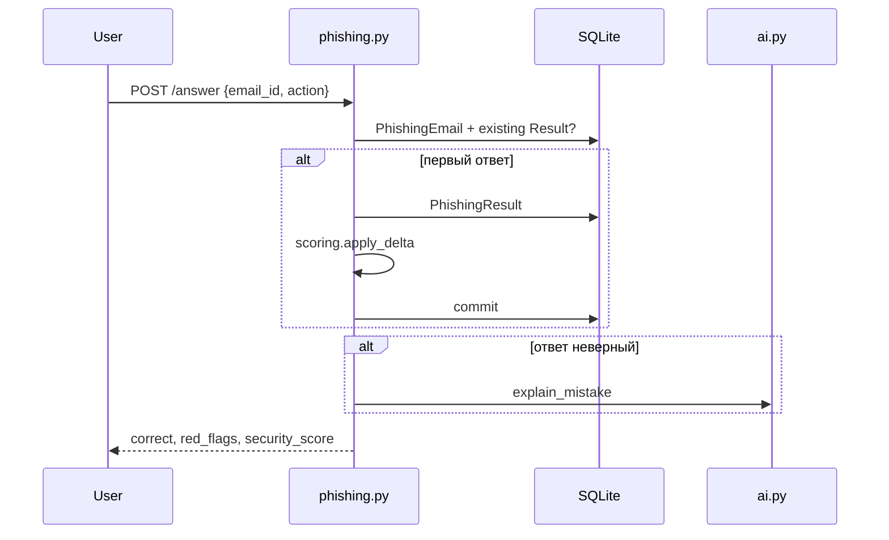
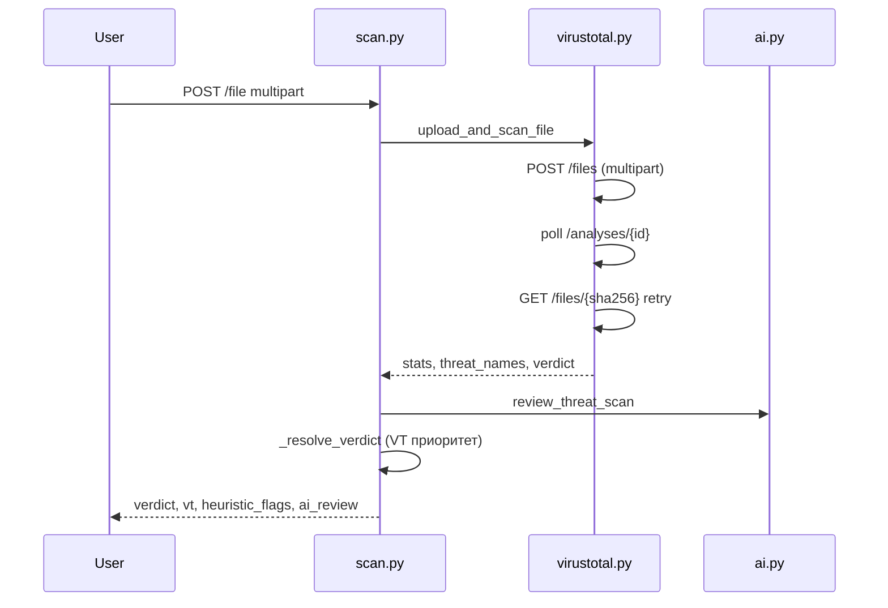

# CyberBook: ревью кода и ответы на вопросы

Документ для защиты хакатона и онбординга второго бэкендера.  
Контракт эндпоинтов: [API.md](API.md). Задачи по зонам: [TASKS.md](TASKS.md).

---

## 1. Что это за продукт

Корпоративный тренажёр кибербезопасности (кейс МТС):

- обучение (курсы, уроки, квизы);
- симулятор фишинга (инбокс);
- AI-ассистент (Cerebras);
- сканер ссылок/файлов (VirusTotal);
- геймификация (Security Score, очки, бейджи, рейтинг).

Один Flask-сервер отдаёт JSON API (`/api/*`) и статику (`static/`).

---

## 2. Архитектура

```
┌─────────────┐     cookie-сессия      ┌──────────────────────────────────┐
│ static/*.html│ ◄──────────────────► │ app.py (create_app)              │
│ script.js   │   fetch + credentials │  ├─ blueprints/* (REST)           │
└─────────────┘                        │  ├─ models.py (SQLAlchemy)      │
                                       │  ├─ scoring.py (формулы)        │
                                       │  ├─ ai.py (Cerebras)            │
                                       │  └─ virustotal.py (VT API v3)   │
                                       └──────────────┬───────────────────┘
                                                      │
                                              SQLite cyberbook.db
```

### Точка входа

| Файл | Роль |
|------|------|
| `app.py` | Фабрика приложения, регистрация blueprints, раздача статики, `db.create_all()` |
| `config.py` | `.env`: SECRET_KEY, DATABASE_URL, CEREBRAS_*, VIRUSTOTAL_*, SCAN_MAX_FILE_MB |
| `extensions.py` | `db` (SQLAlchemy), `login_manager` (Flask-Login) |
| `seed.py` | Пересоздание БД + демо-контент (`python seed.py`) |

### Авторизация

- Flask-Login, сессия в cookie.
- `@login_required` на почти всех `/api/*`.
- `@admin_required` (`helpers.py`): `current_user.role == "admin"` иначе 403.
- Роли: `admin`, `employee`.
- Неавторизованный запрос → JSON `{"error":"Требуется авторизация"}`, 401.

Фронт: `fetch(..., { credentials: "same-origin" })` в `static/script.js`.

---

## 3. Модели данных (`models.py`)

### Пользователь

`User`: email (unique), password_hash, role, department, `security_score` (0–100), `points`.

Связи: quiz_attempts, phishing_results, badges, course_progress, lesson_progress, threat_scans.

### Обучение

| Модель | Назначение |
|--------|------------|
| `Course` | Курс: title, description, content, video_url, topic, order |
| `Lesson` | Урок внутри курса (FK course_id) |
| `CourseProgress` | user + course, completed (unique пара) |
| `LessonProgress` | user + lesson, completed (unique пара) |

### Квизы

| Модель | Назначение |
|--------|------------|
| `Quiz` | Привязка к course_id опциональна, флаг ai_generated |
| `Question` | text, options (JSON), correct_index, explanation |
| `QuizAttempt` | score %, correct/total, история |

**Важно:** `GET /api/quiz/<id>` отдаёт квиз **без** `correct_index` (`with_answers=False`). Ответы видны только в `review` после submit.

### Фишинг

| Модель | Назначение |
|--------|------------|
| `PhishingEmail` | sender, subject, body, is_phishing, red_flags, difficulty |
| `PhishingResult` | ответ пользователя: action, correct |

До ответа инбокс **не раскрывает** `is_phishing` и `red_flags` (`to_dict(reveal=False)`).

### Сканер

`ThreatScan`: scan_type (`url`/`file`), target, verdict, vt_stats, ai_review, red_flags.

### Бейджи

`Badge`: name + icon, один раз на пользователя (проверка в `scoring.award_badge`).

---

## 4. Геймификация (`scoring.py`)

### Два разных числа

1. **`security_score`** (0–100) на пользователе — меняется сразу за действия (дельты).
2. **`formula_score`** — расчётный показатель для аналитики/рейтинга, не перезаписывает score автоматически.

### Дельты Security Score (мгновенные)

| Событие | Константа | Значение |
|---------|-----------|----------|
| Фишинг верно | `PHISH_CORRECT` | +8 |
| Фишинг неверно | `PHISH_WRONG` | -12 |
| Урок пройден | `LESSON_COMPLETE` | +3 |
| Курс пройден | `COURSE_COMPLETE` | +8 |
| Квиз | `QUIZ_BONUS_MAX * correct/total` | до +10 |

### Очки (`points`)

| Событие | Очки |
|---------|------|
| Правильный ответ в квизе | +10 |
| Фишинг пойман | +15 |
| Урок | +20 |
| Курс | +50 |
| Скан (любой) | +5 |

### Формула (для `/api/stats/me` → `formula`)

```
score = clamp(50
  + (avg_quiz - 50) * 0.35
  + (catch_rate - 50) * 0.35
  + course_completion% * 0.20
  - click_rate% * 0.15)
```

`catch_rate` = % правильных ответов на фишинг.  
`click_rate` = % действия `clicked` (сейчас UI в основном `trusted`/`reported`).

### Бейджи (автовыдача)

- По score: Кибер-Страж (80+), Неприступный (95+)
- По активности: Знаток квизов (3+ попытки), Ученик ИБ (1 курс), Мастер обучения (3 курса), Охотник за очками (200+ points)
- По событиям: Отличник ИБ (100% квиз), Охотник на фишинг, Аналитик угроз (сканер)

---

## 5. Блоки API (blueprints)

### 5.1 Auth — `blueprints/auth.py`

| Эндпоинт | Логика |
|----------|--------|
| POST `/register` | employee, login сразу после регистрации |
| POST `/login` | email lowercase, check_password |
| POST `/logout` | login_required |
| GET `/me` | текущий user или 401 |
| PATCH `/me` | частичное обновление, смена email с проверкой уникальности |

### 5.2 Admin — `blueprints/admin.py`

| Эндпоинт | Логика |
|----------|--------|
| POST `/users` | создать employee |
| DELETE `/users/<id>` | каскадное удаление QuizAttempt, PhishingResult, Badge, CourseProgress, LessonProgress, **ThreatScan**; нельзя удалить себя или admin |

### 5.3 Курсы — `blueprints/courses.py` *(2-й бэкенд)*

- Список курсов с флагом `completed` для текущего user.
- `GET /<id>` — полный курс + уроки + квизы + completed по урокам.
- CRUD курсов/уроков — только admin.
- `POST .../complete` — идемпотентность: повтор → 409.
- При завершении всех уроков курса автоматически создаётся `CourseProgress` на курс.

### 5.4 Квизы — `blueprints/quiz.py` *(2-й бэкенд)*

| Эндпоинт | Логика |
|----------|--------|
| GET `/` | список без ответов |
| GET `/history` | последние 50 попыток user |
| POST `/<id>/submit` | `{answers:[index,...]}`, review с explanation |
| POST `/generate` | AI-квиз → сохранение в БД |
| POST `/personalized` | слабые темы из avg score < 70 и ошибок фишинга |
| POST/PUT/DELETE | admin CRUD |

Персонализация: GROUP BY course_id по QuizAttempt, topic курса с низким avg, иначе «Фишинг» или «общая кибербезопасность».

### 5.5 Фишинг — `blueprints/phishing.py` *(ядро)*

**Правило оценки:**

- Письмо фишинговое (`is_phishing=true`) → верно только `reported`
- Легитимное → верно только `trusted`
- `clicked` всегда неверно для фишинга

**Двойное начисление запрещено:** если `PhishingResult` уже есть, score не меняется (тест `test_no_double_scoring`).

При ошибке: `ai.explain_mistake(context)` (если Cerebras недоступен — статический текст).

`POST /generate` (admin): `ai.generate_phishing` → новое письмо в общий инбокс.

**Демо:** `ivan@mts.ru` в seed оставлен с чистым инбоксом (без PhishingResult), чтобы на защите показать рост score с нуля.

### 5.6 AI-ассистент — `blueprints/assistant.py` *(ядро)*

`POST /chat`: message + history (user/assistant) + `build_user_context(user)`:

- имя, отдел, security_score;
- средний балл квизов (если < 70 — подсказка модели объяснять подробнее);
- темы писем, где user ошибся в фишинге.

Ответ: `{reply, ai: bool}`.

### 5.7 Статистика — `blueprints/stats.py` *(2-й бэкенд)*

| Эндпоинт | Кто | Что |
|----------|-----|-----|
| `/me` | user | score, points, formula, история |
| `/leaderboard` | user | топ-20 employee по security_score |
| `/overview` | admin | сводка по компании |
| `/timeline` | admin | 30 дней: квизы, фишинг, курсы |
| `/users` | admin | таблица сотрудников |
| `/export/<id>` | admin | CSV |
| `/export/<id>/pdf` | admin | PDF (fpdf2 + DejaVu шрифт в assets/fonts) |

### 5.8 Сканер — `blueprints/scan.py` + `virustotal.py` *(ядро)*

#### Поток проверки URL

```
POST /api/scan/url {url}
  → нормализация (добавить https://)
  → vt.scan_url(url)
  → vt.heuristic_url_flags(url)     # учебная эвристика, отдельно от вердикта
  → ai.review_threat_scan(...)
  → _resolve_verdict()              # если VT дал stats — вердикт ТОЛЬКО от VT
  → ThreatScan в БД + очки + бейдж
```

#### Поток проверки файла

```
POST /api/scan/file
  вариант A: multipart field "file"  → upload_and_scan_file(bytes, name)
  вариант B: JSON {sha256}           → scan_file_hash
```

#### Вердикты

`clean` | `suspicious` | `malicious` | `unknown`

**Ключевое правило (после фикса):** если VT вернул полную статистику движков, `_resolve_verdict` берёт вердикт VT. Эвристика URL (login/verify, подделка бренда, HTTP) показывается отдельным блоком на фронте и **не** переводит clean (0/92) в suspicious.

#### VirusTotal (`virustotal.py`)

| Функция | Назначение |
|---------|------------|
| `scan_url` | GET `/urls/{base64url}`; 404 → POST `/urls` → poll analysis → повторный GET |
| `scan_file_hash` | GET `/files/{sha256}` |
| `upload_and_scan_file` | multipart `file` (не raw octet-stream!); >32MB → `/files/upload_url`; poll + retry GET по hash |
| `heuristic_url_flags` | IP, @, TLD, login/password, brand fakes, HTTP |
| `verdict_from_stats` | malicious ≥2; или ≥1 malicious / ≥3 suspicious; иначе clean если нет детектов |

Без `VIRUSTOTAL_API_KEY`: VT-функции возвращают `None`, работают эвристика + AI fallback.

#### AI в сканере (`ai.review_threat_scan`)

1. Промпт с данными VT + эвристикой, ответ JSON.
2. Если Cerebras недоступен → `_threat_review_fallback(vt_report, flags, scan_type)` с разными текстами для url/file.

`POST /api/scan/review` (разбор текста) — **есть в API**, на фронте убран (есть AI-чат). Эндпоинт жив для интеграций.

---

## 6. AI-слой (`ai.py`)

Обёртка Cerebras (OpenAI-compatible client).

| Функция | Использование | Fallback без ключа |
|---------|---------------|-------------------|
| `assistant_reply` | чат | статические ответы по ключевым словам |
| `generate_quiz` | /quiz/generate, personalized | `_FALLBACK_QUIZ` |
| `generate_phishing` | /phishing/generate | `_FALLBACK_PHISH` |
| `explain_mistake` | неверный ответ фишинга | шаблонный разбор |
| `review_threat_scan` | сканер url/file | `_threat_review_fallback` |
| `review_suspicious_text` | /scan/review | статический suspicious |

Клиент кэшируется в `_client` (singleton на процесс). Ошибки API логируются, не падают наружу.

Переменные: `CEREBRAS_API_KEY`, `CEREBRAS_BASE_URL`, `AI_MODEL` (default `gpt-oss-120b`).

---

## 7. Фронтенд (`static/`)

| Страница | Инициализация в script.js |
|----------|---------------------------|
| index/register | doLogin, doRegister |
| dashboard | `#score-value` → initDashboard |
| courses | `#courses-grid` |
| quiz | `#quiz-list` |
| inbox | `#inbox-list` |
| scan | `#scan-url-input` → initScanner |
| chat | `#chat-area` |
| rating | `#rating-list` |
| achievements | `#achievements-grid` |
| admin | `#employees-list` |
| profile | `#profile-display-name` |

API-слой: объект `API` в `script.js`.  
Файлы: `apiUpload` для `/api/scan/file` (без JSON Content-Type).

---

## 8. Тесты (`tests/`)

41 тест, pytest. В `conftest.py`:

- временная SQLite;
- `CEREBRAS_API_KEY=""`, `VIRUSTOTAL_API_KEY=""` → детерминированные fallback, без сети;
- фикстуры `emp_client`, `admin_client`.

| Файл | Что проверяет |
|------|---------------|
| test_auth | login, health |
| test_admin | профиль, CRUD users |
| test_phishing | инбокс без спойлеров, scoring, no double |
| test_quiz | скрытие ответов, submit |
| test_scan | офлайн скан, эвристика IP |
| test_scoring | формула, clamp |
| test_stats | me, leaderboard, admin overview |

---

## 9. Переменные окружения (`.env.example`)

| Переменная | Обязательность | Эффект если пусто |
|------------|----------------|-------------------|
| `SECRET_KEY` | prod | dev-secret, warning |
| `DATABASE_URL` | нет | sqlite `cyberbook.db` |
| `CEREBRAS_API_KEY` | нет | AI fallback |
| `VIRUSTOTAL_API_KEY` | нет | сканер без VT, эвристика |
| `SCAN_MAX_FILE_MB` | нет | default 32 |

Генерация секретов: `python scripts/gen_secrets.py` или `build.ps1 -Seed`.

**После clone:** `python seed.py` (иначе БД пустая, логин не работает).

---

## 10. Частые вопросы на защите (шпаргалка)

### «Как считается Security Score?»

Два уровня: мгновенные дельты при действиях (фишинг ±8/12, курс +8…) и аналитическая формула в `/api/stats/me` → `formula`. Рейтинг сортирует по полю `security_score` на User.

### «Почему фишинговое письмо не показывает, фишинг ли оно?»

Учебный режим: до ответа пользователь сам решает. После ответа — `is_phishing`, `red_flags`, AI-разбор при ошибке.

### «Почему ссылка mts-verify-login.ru чистая в VT, но эвристика что-то пишет?»

VT смотрит репутацию у 90+ антивирусов. Эвристика учит сотрудников признакам фишинга (чужой домен, HTTP, слова login). Вердикт на экране = VT (0/92 → **Безопасно**), эвристика отдельным жёлтым блоком.

### «Почему upload файла давал 400?»

VT API v3 требует `multipart/form-data` с полем `file`, не сырой body. Исправлено в `upload_and_scan_file`.

### «Сколько ждать проверку файла?»

До ~90 сек: upload → poll analysis → retry GET `/files/{sha256}`. Повторная проверка того же hash мгновенная.

### «Где персонализация?»

- Квиз: `/api/quiz/personalized` по слабым темам.
- Чат: контекст user в `build_user_context`.
- Фишинг: admin генерирует новые письма под тему.

### «Как разделены зоны ответственности?»

| Зона | Файлы | Кто |
|------|-------|-----|
| Ядро, AI, фишинг, сканер | `ai.py`, `phishing.py`, `assistant.py`, `scan.py`, `virustotal.py` | phaeton |
| Контент, квизы, stats | `courses.py`, `quiz.py`, `stats.py`, `scoring.py`, `seed.py` | 2-й бэкенд |
| Фронт | `static/*` | фронтенд |
| Auth, admin | `auth.py`, `admin.py` | общее |

### «Что если API-ключи утекут?»

Ключи только в `.env`, не в репозитории. `.env.example` без секретов.

### «Как добавить новый курс?»

Admin: POST `/api/courses`, уроки POST `/api/courses/<id>/lessons`, или правка `seed.py` + `python seed.py`.

### «Можно ли удалить сотрудника?»

Admin: DELETE `/api/admin/users/<id>`. Удаляются все связанные записи включая сканы.

---

## 11. Диаграммы потоков

### Фишинг: ответ на письмо



### Сканер: файл



---

## 12. Известные ограничения

1. SQLite — один файл, без горизонтального масштабирования (для хакатона ок).
2. `formula_score` и `security_score` могут расходиться (разная семантика).
3. VT free tier: rate limit 429, лимит запросов/мин.
4. PDF export без шрифта DejaVu — транслит fallback.
5. `/api/scan/review` не подключён к UI (есть AI-чат).
6. Инбокс общий для всех пользователей (письма не персональные).
7. Тесты писались с AI-помощью; прод-код комментируется вручную.

---

## 13. Команды для демо

```bash
pip install -r requirements.txt
copy .env.example .env   # ключи Cerebras + VT
python seed.py
python app.py            # http://localhost:5000
python -m pytest -q      # 41 passed
```

Демо-логины: `admin@mts.ru` / `admin123`, `ivan@mts.ru` / `user123`.

---

## 14. Куда смотреть при баге

| Симптом | Файл |
|---------|------|
| 401 на API | не залогинен, cookie |
| Пустая БД | не запущен `seed.py` |
| AI не отвечает | `.env` CEREBRAS_API_KEY, лог `cerebras:` |
| VT upload 400 | `virustotal.py` upload, проверить multipart |
| Ссылка suspicious при 0/92 | `_resolve_verdict`, должен быть clean |
| Score не растёт второй раз | phishing `existing is not None` |
| PDF кракозябры | `assets/fonts/DejaVuSans.ttf` |
| Фронт не шлёт файл | `apiUpload`, не `apiFetch` |

---

*Обновляйте этот файл при изменении логики блоков. API-контракт синхронизируйте с [API.md](API.md).*
